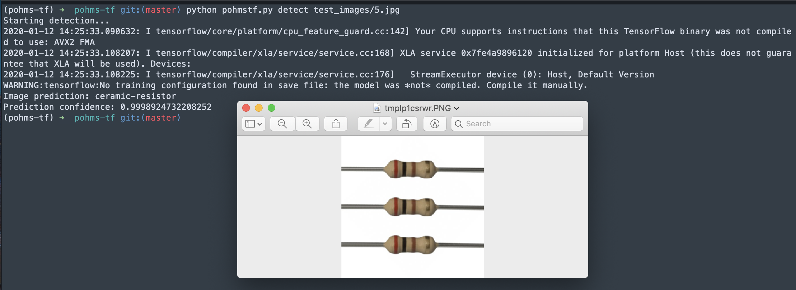

Pohms - Image detector for ceramic resistor or not ceramic resistor

## Requirements

- Python 3.7
- Pip

## Installation

- Clone repo

- Install python environment

	```bash
	# example using venv
	python -m venv ~/pyenvs/pohms-tf # the location of your virtualenv
	
	# activate the virtualenv
	source ~/pyenvs/pohms-tf/bin/activate # location of virtualenv
	```

- Install dependancies
	```bash
	 pip install -r requirements.txt
	````

## Usage

- Pass an image to the detector 
	```bash
	python pohmstf.py detect path-to-image
	```


- Example



